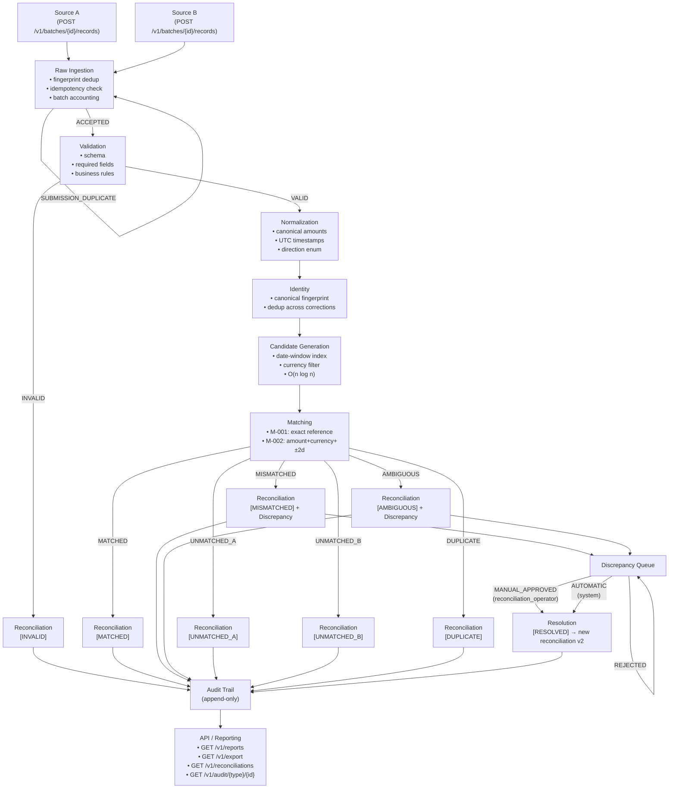
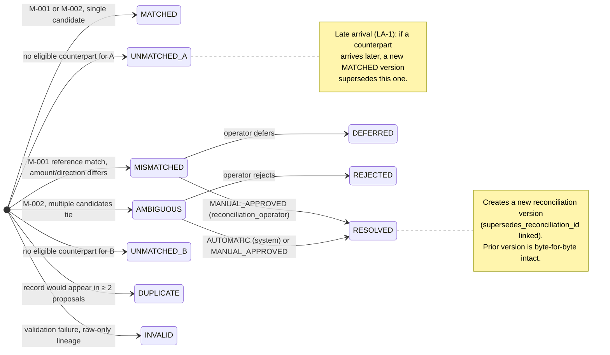
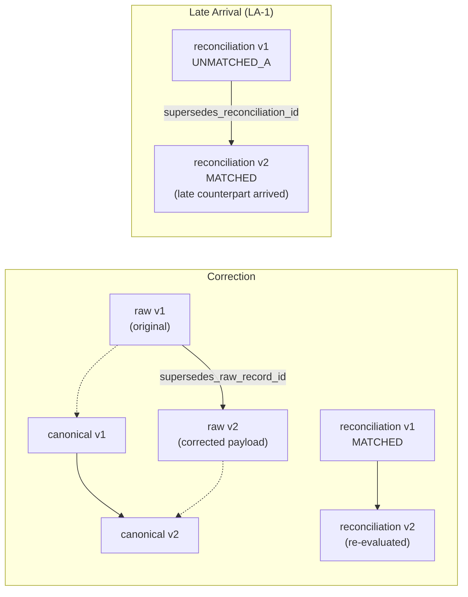
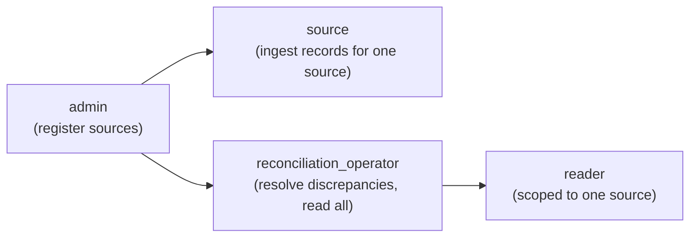
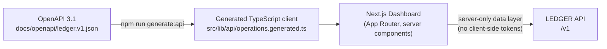
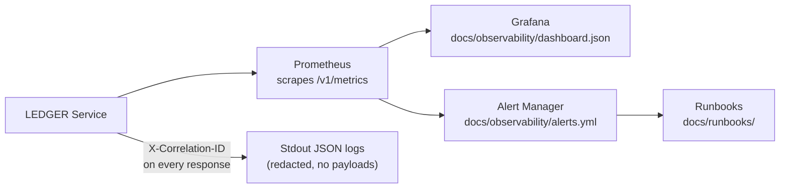

# LEDGER

> **Deterministic 1:1 transaction reconciliation engine** — ingest independently produced records from two sources, match them by configurable business rules, surface every discrepancy with a full audit trail, and resolve each one with an immutable, explainable decision.

[](#testing)
[](#product-proof)
[](#security)
[](#release)
[](LICENSE)

---

## Demo

> Interactive terminal demo — [view the full case study](https://emmanuelzyronis.vercel.app/work/ledger)

```text
$ python -m ledger reconcile --source-a bank_export.csv --source-b ledger_records.csv

Loading sources...
  bank_export.csv        847 transactions  $2,341,892.50
  ledger_records.csv     851 transactions  $2,341,892.50

Matching by: (reference_id, amount, date ±2d)
.......................................................................  847/847

RESULT
──────────────────────────────────────────
  Matched:       843  (99.5%)
  Unmatched A:     4
  Unmatched B:     8
  Net variance:   $0.00

Unmatched in bank_export.csv:
  #0041  2026-09-12  $1,250.00  REF:INV-8821  → no counterpart
  #0187  2026-09-18  $  450.00  REF:INV-9103  → no counterpart

Resolutions → ledger_output/reconciliation-2026-09-25.json
Audit trail  → ledger_output/audit-2026-09-25.jsonl
```

---

## What is LEDGER?

LEDGER reconciles independently produced financial transaction records from two counterparties (Source A and Source B). Given the same inputs, it always produces the same outcome — every decision is deterministic, traceable to the rules that produced it, and preserved forever as immutable evidence.

**Core properties:**

| Property | Guarantee |
|---|---|
| Deterministic | Same inputs + same rule version = same outcome, always |
| Immutable | Accepted records and decisions are never overwritten — corrections and late arrivals append new versions |
| Explainable | Every outcome carries the matching rule, candidate set, and evaluated evidence |
| Auditable | Every state change writes an append-only audit event in the same transaction |
| 1:1 enforced | A record that would participate in two matches is flagged DUPLICATE, never silently forced |
| Idempotent | Replaying ingestion or the full pipeline adds no rows and changes no outcomes |

---

## Architecture

### Pipeline

The reconciliation pipeline is a sequence of independent, deterministic stages. Each stage reads from the authoritative store and writes its outputs atomically.



### Reconciliation state machine

Each reconciliation decision starts in a terminal outcome state. A discrepancy and an authorized resolution move it through a controlled lifecycle — no state machine violation is accepted.



### Data model

```mermaid
erDiagram
    SOURCES {
        string source_id PK
        string name
        string schema_version
    }

    BATCHES {
        string batch_id PK
        string source_id FK
        string state
        int received_count
        int accepted_count
        int processed_count
    }

    RAW_RECORDS {
        string raw_record_id PK
        string batch_id FK
        string source_id FK
        string source_record_id
        string fingerprint
        string status
        string supersedes_raw_record_id FK
    }

    CANONICAL_TRANSACTIONS {
        string canonical_id PK
        string raw_record_id FK
        string fingerprint
        string amount
        string currency
        string direction
        string value_date
        string reference
    }

    MATCH_CANDIDATES {
        string candidate_id PK
        string source_a_canonical_id FK
        string source_b_canonical_id FK
        string rule_id
    }

    RECONCILIATIONS {
        string reconciliation_id PK
        string batch_id FK
        string source_a_record_id FK
        string source_b_record_id FK
        int reconciliation_version
        string rule_version
        string outcome
        string state
        string supersedes_reconciliation_id FK
        json evidence
    }

    DISCREPANCIES {
        string discrepancy_id PK
        string reconciliation_id FK
        string reason
        string state
    }

    RESOLUTIONS {
        string resolution_id PK
        string discrepancy_id FK
        string reconciliation_id FK
        string resolution_type
        string actor
        string reason
        json evidence
    }

    AUDIT_EVENTS {
        string event_id PK
        string entity_type
        string entity_id
        string event_type
        string actor
        string stage_version
        int sequence
        json metadata
    }

    SOURCES         ||--o{ BATCHES               : "owns"
    BATCHES         ||--o{ RAW_RECORDS            : "contains"
    RAW_RECORDS     ||--o{ CANONICAL_TRANSACTIONS : "normalized to"
    CANONICAL_TRANSACTIONS ||--o{ MATCH_CANDIDATES : "generates"
    MATCH_CANDIDATES ||--o{ RECONCILIATIONS       : "evaluated by"
    RECONCILIATIONS ||--o| DISCREPANCIES          : "may create"
    DISCREPANCIES   ||--o| RESOLUTIONS            : "resolved by"
    RECONCILIATIONS ||--o{ AUDIT_EVENTS           : "emits"
    DISCREPANCIES   ||--o{ AUDIT_EVENTS           : "emits"
    RESOLUTIONS     ||--o{ AUDIT_EVENTS           : "emits"
```



### Correction and late-arrival lineage



---

## Quick start

### Option 1 — Local (no dependencies)

```sh
git clone https://github.com/Emmanuelzyronis/Ledger.git
cd Ledger

# Run the service (SQLite, no install required)
PYTHONPATH=src LEDGER_DATABASE_PATH=ledger.sqlite3 python3 -m ledger

# In a separate terminal — check it's healthy
curl http://127.0.0.1:8000/v1/health
```

### Option 2 — Docker

```sh
docker build -t ledger:1.0.0 .

# Run with a persistent database volume
docker run -d \
  -p 8080:8080 \
  -v ledger-data:/var/lib/ledger \
  -e LEDGER_HMAC_SECRET=<your-secret> \
  ledger:1.0.0

curl http://127.0.0.1:8080/v1/health
```

### Option 3 — Release artifact

```sh
# Download and verify
curl -LO https://github.com/Emmanuelzyronis/Ledger/releases/download/v1.0.0/ledger-1.0.0.tar.gz
sha256sum ledger-1.0.0.tar.gz
# expected: fd57b91bdba65fb0caede03fb52718abaf70190019b68faef27bfe120a48bacd

tar xzf ledger-1.0.0.tar.gz
cd ledger-1.0.0
PYTHONPATH=src LEDGER_DATABASE_PATH=ledger.sqlite3 python3 -m ledger
```

---

## Configuration

All configuration is through environment variables. No secrets are ever committed.

| Variable | Default | Description |
|---|---|---|
| `LEDGER_DATABASE_PATH` | `ledger.sqlite3` | Path to the SQLite database file |
| `LEDGER_HOST` | `127.0.0.1` | Bind address |
| `LEDGER_PORT` | `8000` | Listen port |
| `LEDGER_HMAC_SECRET` | — | **Required in production.** HMAC-SHA256 secret for bearer token signing |
| `LEDGER_REQUIRE_TLS` | `false` | Set `true` in production to reject non-TLS requests |
| `LEDGER_ENV` | `development` | `production` enables stricter checks |
| `LEDGER_LOG_LEVEL` | `INFO` | `DEBUG`, `INFO`, `WARNING`, `ERROR` |

---

## API reference

The full contract is `docs/openapi/ledger.v1.json` (OpenAPI 3.1). All `/v1` endpoints require bearer authentication except `/v1/health`, `/v1/ready`, and `/v1/metrics`.

### Endpoints

| Method | Path | Auth | Description |
|---|---|---|---|
| `GET` | `/v1/health` | Public | Liveness — application + database ok |
| `GET` | `/v1/ready` | Public | Readiness — database migrations applied |
| `GET` | `/v1/metrics` | Public | Prometheus metrics (bounded labels) |
| `POST` | `/v1/sources` | admin | Register a new reconciliation source |
| `POST` | `/v1/batches` | source | Open a new ingestion batch |
| `POST` | `/v1/batches/{batch_id}/records` | source | Ingest a single record |
| `GET` | `/v1/batches/{batch_id}` | source | Batch state + accounting |
| `GET` | `/v1/reconciliations` | reader/operator | Paginated reconciliation outcomes |
| `GET` | `/v1/reconciliations/{id}` | reader/operator | Single reconciliation with full evidence |
| `GET` | `/v1/discrepancies` | operator | Open discrepancy queue |
| `GET` | `/v1/discrepancies/{id}` | operator | Single discrepancy |
| `POST` | `/v1/discrepancies/{id}/resolve` | operator | Apply a resolution |
| `GET` | `/v1/reports` | reader/operator | Outcome-count summary (optionally batch-scoped) |
| `GET` | `/v1/export` | reader/operator | Read-only reconciliation export (no raw payloads) |
| `GET` | `/v1/audit/{entity_type}/{entity_id}` | reader/operator | Append-only audit trail |

### Authorization roles



### Example: ingest a record

```sh
# 1. Create a source (admin)
curl -X POST http://127.0.0.1:8000/v1/sources \
  -H "Authorization: Bearer $ADMIN_TOKEN" \
  -H "Content-Type: application/json" \
  -d '{"source_id": "bank-a", "name": "Bank A", "schema_version": "bank_a.v1"}'

# 2. Open a batch (source)
curl -X POST http://127.0.0.1:8000/v1/batches \
  -H "Authorization: Bearer $SOURCE_A_TOKEN" \
  -H "Content-Type: application/json" \
  -d '{"source_id": "bank-a", "batch_id": "batch-2026-09-19"}'

# 3. Ingest a record (source)
curl -X POST http://127.0.0.1:8000/v1/batches/batch-2026-09-19/records \
  -H "Authorization: Bearer $SOURCE_A_TOKEN" \
  -H "Content-Type: application/json" \
  -d '{
    "source_record_id": "TXN-001",
    "amount": "1000.00",
    "currency": "USD",
    "direction": "CREDIT",
    "value_date": "2026-09-19",
    "reference": "INV-2026-001"
  }'

# 4. Check reconciliation outcomes (operator)
curl http://127.0.0.1:8000/v1/reports \
  -H "Authorization: Bearer $OPERATOR_TOKEN"
```

### Example: resolve a discrepancy

```sh
curl -X POST http://127.0.0.1:8000/v1/discrepancies/discrepancy:abc123/resolve \
  -H "Authorization: Bearer $OPERATOR_TOKEN" \
  -H "Content-Type: application/json" \
  -d '{
    "resolution_type": "MANUAL_APPROVED",
    "reason": "Reference verified; amount variance accepted per policy"
  }'
```

The response includes the new superseding reconciliation version and the full resolution lineage.

---

## Matching rules

Two matching rules are applied in priority order. The first rule that produces exactly one match wins.

| Rule | ID | Logic | Result on single match | Result on multiple |
|---|---|---|---|---|
| Exact reference | M-001 | Same `reference`, same `currency`, opposite `direction` | MATCHED or MISMATCHED (if amounts differ) | — |
| Fuzzy amount + date | M-002 | Same `amount`, `currency`, opposite `direction`, value dates within ±2 calendar days | AMBIGUOUS (multiple candidates tie) | AMBIGUOUS |

No match on any rule → UNMATCHED. A record appearing in two simultaneous proposals → DUPLICATE.

---

## Reconciliation outcomes

| Outcome | Meaning | Follow-up |
|---|---|---|
| `MATCHED` | Exact 1:1 pair found | None required |
| `MISMATCHED` | Pair found but amounts or direction differ | Discrepancy → operator resolution |
| `AMBIGUOUS` | Multiple candidates tie; no single winner | Discrepancy → operator resolution or system auto |
| `UNMATCHED_A` | Source A record with no counterpart | Stays open; may be superseded by late arrival |
| `UNMATCHED_B` | Source B record with no counterpart | Same |
| `DUPLICATE` | Record would appear in ≥ 2 match proposals | No winner chosen; flagged for review |
| `INVALID` | Record failed validation | Raw-only lineage; no canonical transaction |

---

## Performance

Measured on a single-host reference environment (Linux, Python 3.12.3, SQLite 3.45.1 WAL). D-009 SLOs are floors chosen with a ~4× margin against the baseline, not capacity guarantees.

| Metric | D-009 SLO | Measured baseline |
|---|---|---|
| Pipeline processing throughput | ≥ 25 records/s | 95.5 records/s |
| HTTP ingest throughput | ≥ 50 records/s | 177–216 records/s |
| Read API p95 latency (8 concurrent) | ≤ 250 ms | 11.0–11.8 ms |
| Read API p99 latency (8 concurrent) | ≤ 500 ms | 14.3–18.1 ms |
| Unexpected errors under load | 0 | 0 |
| RPO (full snapshot cadence) | ≤ 15 min | 15 min policy |
| RTO (restore + verify) | ≤ 30 min | 0.038–0.082 s measured |

---

## Testing

### Run all checks

```sh
make check
# 254 tests: unit, integration, idempotency, state-machine, failure, performance, product-proof
```

### Product proof (full end-to-end)

The product proof runs the complete pipeline on real SQLite with deterministic fixtures — no mocks. It proves all seven outcomes, all five resolution workflows, late-arrival LA-1 supersession, immutability, and API security.

```sh
PYTHONPATH=src python3 product_proof/run_product_proof.py
# writes evidence/product-proof.json — 42/42 checks, deterministic signature
```

### Staging rehearsal (representative load)

```sh
make staging-proof
# 1420 records across 60 portfolio shards
# 8 concurrent HTTP clients, recovery drill, outcome verification
```

### Database operations drill

```sh
make db-drill
# backup → corrupt-detection → restore → integrity verify
# reports measured recovery against RPO/RTO targets
```

### Observability proof

```sh
make observability-proof
# alert drill: all 10 rules fire on their condition
# metrics scrape, correlation-ID echo, redaction proof
```

### Frontend (Next.js dashboard)

```sh
cd frontend
npm install
npm run check        # generate:api + format + typecheck + lint + vitest (15 tests) + build
npm run test:e2e     # 4 Playwright tests against real service + real Next.js server
```

---

## Frontend dashboard

`frontend/` is a Next.js (App Router) reconciliation dashboard. It consumes only the published `/v1` contract and generates its typed API client from `docs/openapi/ledger.v1.json` at build time.



**Screens:**

| Screen | Path | Description |
|---|---|---|
| Ingest | `/ingest` | Submit a transaction record through the API |
| Reconciliation | `/reconciliation` | Browse all outcomes with outcome filter |
| Discrepancies | `/discrepancies` | Open discrepancy queue |
| Discrepancy detail | `/discrepancies/[id]` | Evidence, history, resolution form |
| Reports | `/reports` | Outcome-count summary |
| Export | `/reports/export` | Download reconciliation projection |

```sh
cd frontend
npm run dev   # dashboard on http://127.0.0.1:3000
              # LEDGER service must be running on http://127.0.0.1:8000
```

---

## Deployment

### Docker (recommended)

```sh
# Build
docker build -t ledger:1.0.0 .

# Production run (non-root, persistent volume)
docker run -d \
  --name ledger \
  --restart unless-stopped \
  -p 8080:8080 \
  -v ledger-data:/var/lib/ledger \
  -e LEDGER_HMAC_SECRET="$(openssl rand -hex 32)" \
  -e LEDGER_REQUIRE_TLS=true \
  -e LEDGER_ENV=production \
  ledger:1.0.0
```

### Schema migrations

```sh
# Apply migrations to an existing database
PYTHONPATH=src python3 -m ledger.ops migrate --db ledger.sqlite3

# Verify integrity
PYTHONPATH=src python3 -m ledger.ops integrity --db ledger.sqlite3

# Backup
PYTHONPATH=src python3 -m ledger.ops backup --db ledger.sqlite3 --dest backups/
```

### Security checklist

- Set `LEDGER_HMAC_SECRET` to a cryptographically random value (≥ 32 bytes)
- Set `LEDGER_REQUIRE_TLS=true` behind a TLS-terminating reverse proxy
- Mount `/var/lib/ledger` on an encrypted volume
- Rotate bearer tokens; tokens are signed, not stored — change the secret to invalidate all tokens
- Run `python3 scripts/scan.py --require-tools` before every release

---

## Observability



**10 alert rules** — each linked to a runbook:

| Alert | Condition | Runbook |
|---|---|---|
| LedgerServiceDown | Service unreachable | `docs/runbooks/service-down.md` |
| LedgerReadinessFailing | `/v1/ready` failing | `docs/runbooks/database-unavailable.md` |
| LedgerDatabaseFailures | DB error counter rising | `docs/runbooks/database-unavailable.md` |
| LedgerAuditFailures | Audit write errors | `docs/runbooks/audit-failure.md` |
| LedgerProcessingFailures | Pipeline errors | `docs/runbooks/processing-failures.md` |
| LedgerRetryStorm | Excessive retries | `docs/runbooks/processing-failures.md` |
| LedgerServerErrorRatio | 5xx rate elevated | `docs/runbooks/high-error-rate.md` |
| LedgerLatencyHigh | p95 > threshold | `docs/runbooks/high-latency.md` |
| LedgerSaturation | Saturation metric high | `docs/runbooks/saturation.md` |
| LedgerBackupStale | Backup timestamp stale | `docs/runbooks/backup-failure.md` |

---

## Project structure

```
Ledger/
├── src/ledger/             # Application source
│   ├── domain/             # Domain model: entities, state machines, invariants
│   ├── persistence/        # SQLite repositories, migrations, schema
│   ├── ingestion.py        # Raw ingestion — fingerprint, dedup, batch accounting
│   ├── validation.py       # Schema + business-rule validation
│   ├── normalization.py    # Canonical form: amounts, dates, direction
│   ├── identity.py         # Deterministic canonical fingerprint
│   ├── candidates.py       # Candidate generation (indexed, O(n log n))
│   ├── matching.py         # M-001 / M-002 matching rules
│   ├── reconciliation.py   # Decision persistence, versioning, LA-1
│   ├── resolution.py       # Resolution: MANUAL_APPROVED, AUTOMATIC, DEFERRED, REJECTED
│   ├── reporting.py        # Read-only projections: reports, export
│   ├── pipeline.py         # Operator pipeline runner
│   ├── api.py              # ASGI HTTP API (OpenAPI 3.1)
│   ├── security.py         # HMAC bearer token auth, role enforcement
│   ├── observability.py    # Structured telemetry, Prometheus metrics
│   ├── alerts.py           # Alert rule evaluation
│   ├── ops.py              # Database CLI: migrate, verify, backup, drill
│   ├── config.py           # Environment-variable configuration
│   └── service.py          # ASGI app factory
├── frontend/               # Next.js reconciliation dashboard
│   ├── src/app/            # App Router pages (ingest, reconciliation, discrepancies, reports)
│   ├── src/lib/api/        # Generated TypeScript client (from OpenAPI spec)
│   └── e2e/                # Playwright end-to-end tests
├── tests/                  # Test suite (254 tests)
├── product_proof/          # End-to-end deterministic proof runner
├── benchmarks/             # Performance benchmark runner
├── staging/                # Staging rehearsal runner
├── observability/          # Observability proof runner
├── scripts/                # release.py, scan.py
├── evidence/               # Reproducible JSON evidence artifacts
├── docs/                   # Architecture decisions, runbooks, OpenAPI spec
│   ├── openapi/ledger.v1.json
│   ├── runbooks/
│   └── observability/
├── Architecture.md         # Authoritative architecture (source of truth)
├── Makefile                # make check, make staging-proof, make db-drill, …
├── Dockerfile              # Multi-stage, non-root, production image
└── VERSION                 # 1.0.0
```

---

## Invariants

These invariants are enforced in code and verified by the product proof. No implementation change may weaken them.

| ID | Invariant | Enforced by |
|---|---|---|
| L-INV-001 | Accepted raw records are immutable | Persistence layer rejects any UPDATE |
| L-INV-002 | Normalization is deterministic | Same raw input → identical canonical fingerprint |
| L-INV-003 | Identity generation is deterministic | Fingerprint is a function of schema-version + canonical fields only |
| L-INV-004 | Repeated ingestion is idempotent | Fingerprint dedup + pipeline replay guards |
| L-INV-005 | No accepted input disappears without an explicit state | All 17 portfolio records reach an explicit outcome |
| L-INV-006 | Every decision is explainable | Evidence carries rule_version, candidate_order, evaluated_at |
| L-INV-007 | Ambiguous candidates are never silently forced | AMBIGUOUS outcome requires an authorized resolution |
| L-INV-008 | Audit history is preserved | Append-only audit_events; audit stage coverage proven |
| L-INV-009 | 1:1 reconciliation is enforced | DUPLICATE outcome with no winner when conflict detected |
| L-INV-010 | Corrections preserve historical evidence | supersedes_raw_record_id chain; prior rows byte-for-byte intact |
| L-INV-011 | Illegal state transitions are rejected | Resolution state machine enforced by domain + persistence |
| L-INV-012 | Source-native IDs are not universal transaction IDs | Canonical IDs are derived from content fingerprints |

---

## Release

**v1.0.0** — released 2026-09-19

| Evidence | File |
|---|---|
| Release gate checklist | `evidence/release-checklist-1.0.0.md` |
| Artifact manifest + SHA-256 | `evidence/release-1.0.0.json` |
| Product proof (42/42) | `evidence/product-proof.json` |
| Security scan (0 findings) | `evidence/security-scan.json` |
| Staging rehearsal | `evidence/staging-proof.json` |
| DB operations drill | `evidence/database-operations.json` |
| Observability proof | `evidence/observability.json` |
| Performance baseline | `evidence/performance-baseline.json` |

Artifact SHA-256: `fd57b91bdba65fb0caede03fb52718abaf70190019b68faef27bfe120a48bacd`

---

## Development

### Prerequisites

- Python 3.12+
- Node.js 20+ (frontend only)
- Optional: `bandit`, `pip-audit`, `trivy` (for `scripts/scan.py --require-tools`)
- Optional: Playwright (for E2E tests: `npx playwright install --with-deps chromium`)

### Running checks

```sh
make check              # 254 tests + compile check + whitespace check
make db-drill           # backup/restore/integrity drill
make staging-proof      # representative load rehearsal
make observability-proof
python3 scripts/scan.py --require-tools
python3 scripts/release.py build --version 1.0.0 --output dist
```

### Adding a matching rule

1. Define the rule in `Architecture.md` under §22 (matching rules) and assign it a rule ID (M-00N).
2. Implement the rule condition in `src/ledger/matching.py` — the rule evaluates a canonical pair and returns `True/False`.
3. Add the rule ID to the ordered `RULE_CHAIN` list in `matching.py`. Priority is list order.
4. Add unit tests in `tests/test_matching.py` covering all outcome branches.
5. Update the product proof dataset if the new rule changes any portfolio outcome.
6. Update `docs/openapi/ledger.v1.json` if new fields are involved.

### Architecture decisions

Key decisions live in `Architecture.md`:

| Decision | Summary |
|---|---|
| D-007 | Late-arrival (LA-1) versioning: new superseding version, prior immutable |
| D-009 | Numerical performance SLOs (resolved against Epic 8 staging rehearsal) |
| D-014 | RPO ≤ 15 min, RTO ≤ 30 min; SQLite single-writer store accepted for v1.0 |
| D-015 | Superseded canonical versions remain in candidate graph for v1.0 |

---

## License

MIT — see [LICENSE](LICENSE).
